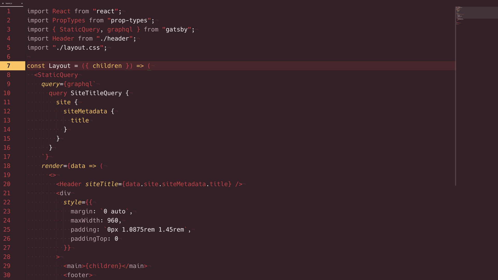

# Megumin Syntax Theme

This theme is inspired by the KonoSuba character, [Megumin](https://myanimelist.net/character/117225/Megumin).

This theme is mainly optimized for JS but looks great (in my opinion) with other languages.

## Installation
On your console:

```
apm install megumin-syntax
```

or install via Atom's settings install tab.

This theme works best when paired with a dynamic UI theme like [Kecleon UI](https://github.com/arturoalviar/atom-kecleon-ui) (I made that UI theme).

```
apm install kecleon-ui
```

## Screenshots


